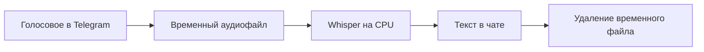

<div align="center">

# 🎙️ Голос в Текст

**Голосовая заметка в Telegram → готовый текст в том же чате.**

[](https://github.com/zordanexe/voice-to-text-telegram-bot/actions/workflows/tests.yml)


Русская речь · Локальное распознавание · Без ключа платного сервиса транскрибации

[Быстрый старт](#быстрый-старт) · [Настройки](#настройки) · [Решение-проблем](#решение-проблем) · [Разработка](#разработка)

</div>

---

Небольшой Telegram-бот для заметок, идей и рабочих поручений. Отправьте голосовое сообщение — бот скачает аудио, распознает русскую речь на вашем компьютере и вернёт текст. Перепечатывать запись вручную не нужно.

## Как это работает



- `/start` и `/help` — подсказка по использованию.
- Распознавание через **faster-whisper**, модель **small**, CPU, `int8`.
- Детектор речи и отдельная проверка полностью пустого аудиосигнала.
- Длинная расшифровка автоматически делится на несколько сообщений.
- Аудиофайл удаляется после обработки, в том числе при ошибке.
- При неподдерживаемом сообщении или ошибке бот объясняет, что делать.

**Пример:** «Завтра в десять утра нужно позвонить клиенту и обсудить новый проект» → «Завтра в 10 утра нужно позвонить клиенту и обсудить новый проект».

## Быстрый старт

Понадобятся **Python 3.11 или новее**, Git, токен от [@BotFather](https://t.me/BotFather) и подключение к интернету. На первом распознавании загружается модель; оставьте свободное место на диске и время на загрузку. Видеокарта не требуется. При установке стандартных бинарных пакетов отдельная установка FFmpeg не нужна: аудио декодируется через PyAV.

Создайте бота в BotFather командой `/newbot`, сохраните полученный токен и клонируйте проект:

```sh
git clone https://github.com/zordanexe/voice-to-text-telegram-bot.git
cd voice-to-text-telegram-bot
```

### Windows · PowerShell

```powershell
powershell -ExecutionPolicy Bypass -File .\run_local.ps1
```

Скрипт создаст `.venv`, установит зависимости и при отсутствии `.env` запросит токен скрытым вводом. Затем запустит бота. Для следующих запусков используйте ту же команду. Активация виртуального окружения не требуется.

Если устанавливаете вручную:

```powershell
python -m venv .venv
.\.venv\Scripts\python.exe -m pip install -r requirements.txt
Copy-Item .env.example .env
notepad .env
.\.venv\Scripts\python.exe bot.py
```

Команду копирования выполняйте только при первом запуске: она заменяет существующий `.env`. В редакторе подставьте токен вместо `replace_with_botfather_token` и сохраните файл перед запуском Python.

### Linux / macOS

```sh
python3 -m venv .venv
.venv/bin/python -m pip install -r requirements.txt
cp -n .env.example .env
```

Откройте `.env` в редакторе, заполните `TELEGRAM_BOT_TOKEN`, затем:

```sh
.venv/bin/python bot.py
```

### Проверка в Telegram

1. Откройте своего бота и отправьте `/start`.
2. Запишите короткое голосовое с отчётливой русской речью.
3. Дождитесь замены сообщения «Распознаю голосовое сообщение…» на текст.
4. Сравните текст с записью. Для остановки бота нажмите `Ctrl+C` в терминале.

Компьютер и процесс бота должны оставаться включёнными. GitHub хранит исходники и запускает тесты; публикация репозитория сама по себе не запускает Telegram-бота. Для постоянной работы нужен постоянно включённый компьютер или сервер. Запускайте **один экземпляр на один токен**.

## Настройки

Файл `.env` находится рядом с `bot.py` и загружается независимо от текущей папки терминала. Переменные, уже заданные в окружении процесса, имеют приоритет.

| Переменная | Значение | Назначение |
| --- | --- | --- |
| `TELEGRAM_BOT_TOKEN` | Токен от BotFather | Обязательная авторизация в Telegram |
| `WHISPER_MODEL_SIZE` | `small` | Модель Whisper; можно выбрать `tiny`, `base`, `medium` или `large-v3` |

Меньшие модели обычно работают быстрее, но могут хуже распознавать речь. Большие требуют больше памяти и времени. Язык распознавания задан в коде: русский. При смене модели может потребоваться новая загрузка.

## Ограничения и данные

- Принимаются **голосовые сообщения Telegram**, до **10 минут** и **20 МБ**. Аудиофайлы, видео и ссылки не поддерживаются.
- Сообщения обрабатываются последовательно. Пока распознаётся длинная запись, следующие ждут.
- Модель может ошибаться на шуме, именах, числах и неразборчивой речи. Проверяйте важные сведения.
- Распознавание выполняется локально. Запись и ответ проходят через Telegram; это не полностью автономный офлайн-сервис.
- Бот не ведёт архив аудио и расшифровок. Журнал `bot.log` содержит технические события и длину результата, но не текст записи. Журнал ограничен по размеру и хранит до двух резервных файлов.
- При принудительном завершении процесса или отключении питания временный файл может остаться в системной папке временных файлов.
- Доступ не ограничен списком пользователей: любой, кто может написать боту, может отправить запись. Учитывайте это при публикации его имени.
- `.env`, окружение, журналы и локальные диагностические файлы исключены из Git. Не вставляйте токен в код, сообщения об ошибках или скриншоты. Если токен раскрыт, отзовите его через BotFather.

## Решение проблем

### Если с телефона работает, а с ПК записывается тишина

Бот одинаково обрабатывает голосовые сообщения с телефона и компьютера. Сначала прослушайте исходное голосовое в Telegram на ПК. Если голоса не слышно, проверьте выбранный микрофон в настройках Telegram и устройство ввода в Windows. Убедитесь, что гарнитура подключена и аппаратное отключение микрофона выключено. Если в вашей версии Telegram доступна проверка микрофона, индикатор должен реагировать на речь. Затем отправьте короткую запись заново. Распознавание не может восстановить речь, которой нет в аудиосигнале.

### Частые вопросы

| Симптом | Что проверить |
| --- | --- |
| `python` не найден | Установите Python и добавьте его в `PATH`, затем откройте новый терминал. |
| Не хватает модулей / установка прервалась | Повторите установку зависимостей командой ниже. |
| Бот завершился сразу после запуска | Проверьте токен в `.env`, интернет и тип ошибки в `bot.log`. |
| `Conflict` в журнале | Остановите другой процесс с тем же токеном, включая экземпляр на сервере. |
| Первая запись обрабатывается долго | Модель загружается и инициализируется. Нужен доступ к Hugging Face; последующие запросы используют кеш. |
| «В записи не обнаружена речь» | Прослушайте запись в Telegram. Проверьте разрешение микрофона и запишите голосовое заново. |
| Неверная расшифровка | Запишите более отчётливую речь без фонового шума; при необходимости выберите более крупную модель. |
| Бот молчит | Проверьте, что процесс запущен, компьютер не спит и сообщение отправлено нужному боту. |

Обновление зависимостей после `git pull`:

```powershell
# Windows
.\.venv\Scripts\python.exe -m pip install -r requirements.txt
```

```sh
# Linux / macOS
.venv/bin/python -m pip install -r requirements.txt
```

## Разработка

```text
bot.py                     Обработка сообщений и локальное распознавание
run_local.ps1              Установка и запуск на Windows
.env.example               Шаблон конфигурации без секретов
requirements.txt           Зависимости Python
tests/test_bot.py          Регрессионные тесты
.github/workflows/tests.yml  Автоматические проверки GitHub Actions
```

Запуск проверок на Windows:

```powershell
.\.venv\Scripts\python.exe -m unittest discover -s tests -v
.\.venv\Scripts\python.exe -m pip check
```

На Linux / macOS замените путь к Python на `.venv/bin/python`.

Тесты проверяют тишину, настройки распознавания, разбиение текста, ограничения записи, обработку ошибок и удаление временного аудио. Они не требуют токена, Telegram или загрузки модели: внешние вызовы заменены тестовыми объектами. GitHub Actions выполняет их на Windows и Linux с Python 3.11 и 3.14.

### Проверено вручную

20 сентября 2026 года проверен полный сценарий в Telegram: голосовые сообщения с телефона и ПК успешно преобразованы в текст. На ПК потребовалось выбрать правильный микрофон. Также проверено распознавание контрольной русской фразы настоящей моделью и отклонение записи с полностью нулевым аудиосигналом.

После установки на другом компьютере выполните проверку своего микрофона и ответа в Telegram по инструкции выше.
